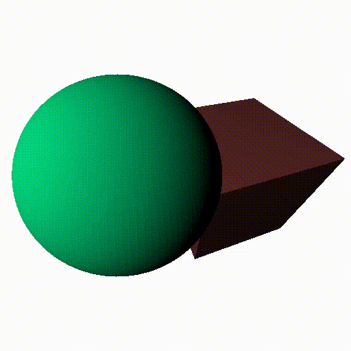
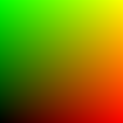
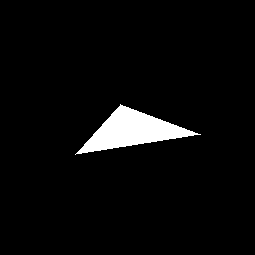
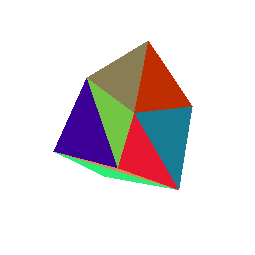
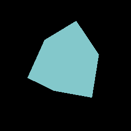
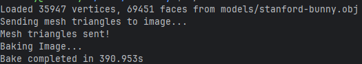
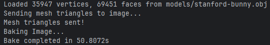
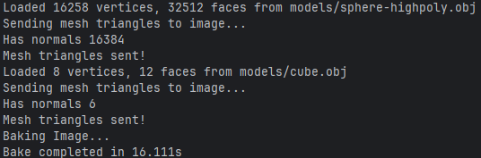
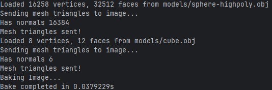

# RasterEye

C++ Multithreaded 3D Rasterizer supporting OBJ file based models. Uses custom shaders to output a ppm image file.

## How to use:
In the root directory run:
- Make: Compile the rasterizer
- ./main: Run the rasterizer
- Make clean: Delete the compiled out file

main.cpp can be edited to load any desired OBJ files. OBJ files should be put in the models folder.

## How does it work? 
RasterEye implements a basic form of rasterization. Rasterization is the process of converting a 3D scene into a 2D array of color to be displayed on screen. The Mesh class reads in an OBJ file line by line, creating Triangles that are fed into the scene. When the rasterizer is told to drawn an image it checks each triangle in the scene. The triangle's bounding box checked for each pixel to see if that point is inside of the triangle. If it is then the color of the triangle is determined. The color of the triangle is determined by the Shader class, and can be customized to shade a triangle as desired. By default Lambertian Diffuse is applied for basic shading. If the point is not inside of the triangle then the backgrund color of the scene is applied. 

To begin I wrote output to a .ppm file. This image was the output:

Then I started out with just a basic triangle with 3 2D points. This is the most basic version of a rasterizer.

Then support for 3D objects was added. First a basic cube with 8 triangles was added.

This simply colored in the triangles with a random color. However, the problem is there were triangles being drawn behind
others. To solve this, a depth buffer was added. If a triangle is behind another, it is ignored. Also, basic shaders were
added. This allows for the output color of the shape to be modified. To start I just inverted the colors of the screen:

This allows us to color the mesh as we please and solves triangles drawing when they shouldn't.
Adding a shader with basic Lambertian Diffuse by taking the dot product of the light direction and the normal we get:

Now we have a well shaded mesh!

However, when we run this with a much more detailed mesh we run into problems:

With only 36,000 verts and a 256x256 image it takes almost 6.5 minutes to output. What can we do to speed this up?

## Optimizations

This code is being run on the main thread only. We have more cores that we could be taking advantage of. The nice part of
the shading problem is that each pixel is independent. Meaning we would divide the work of drawing colors to the pixel array
to several worker threads to make this process parallelized. If we create threads using std::thread and give each thread a chunk of the
pixel output array to solve for we can dramatically decrease the render time:

Multithreading the output has increased the performance by nearly **780%**.

However, for each thread we are checking every triangle for a hit test for every pixel. There are many triangles that will 
never come close to a pixel we are testing. We are wasting time checking every triangle. If we have each thread test every triangle, but only 
its bounding box, or the box of pixels that contains a triangle on screen we can massively reduce the work needed per pixel. 

Before bounding boxes:

After bounding boxes:

With bounding boxes we have reduced the render time from 16.11 seconds to 0.0038 seconds. That is **4240X** faster.
